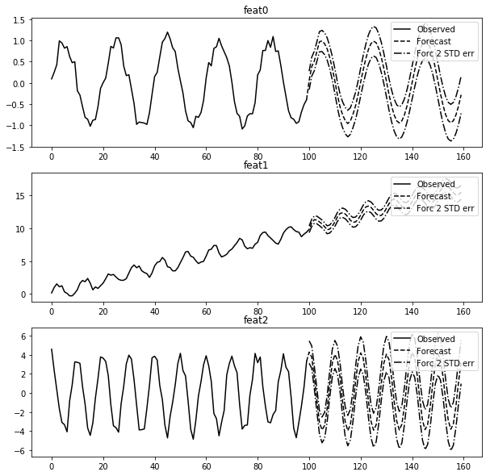

# Autoregressive
Vector autoregressive model that fits multivariate data and forecasts a specified number of steps.

More details on using VAR in statsmodels can be found here: [VAR](https://www.statsmodels.org/devel/vector_ar.html#var)

____
#### An example plot of fitting the test data (test_oscill.csv):

